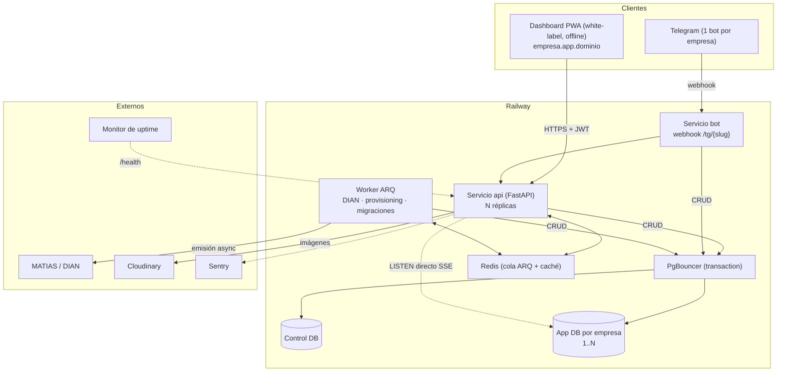
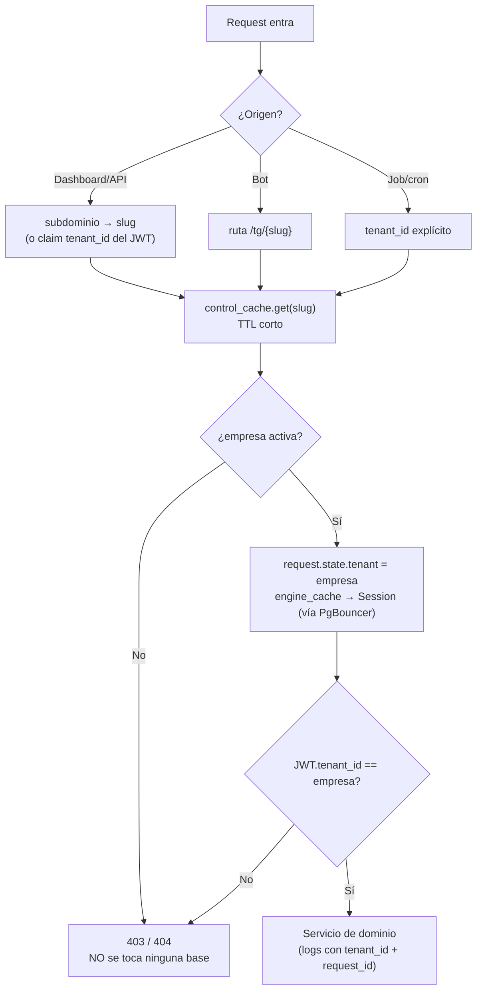
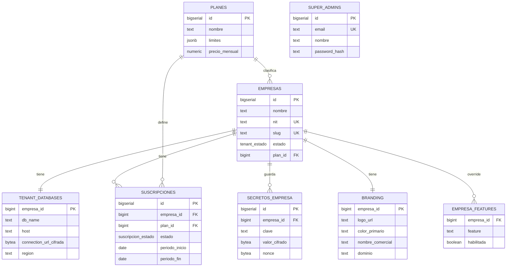
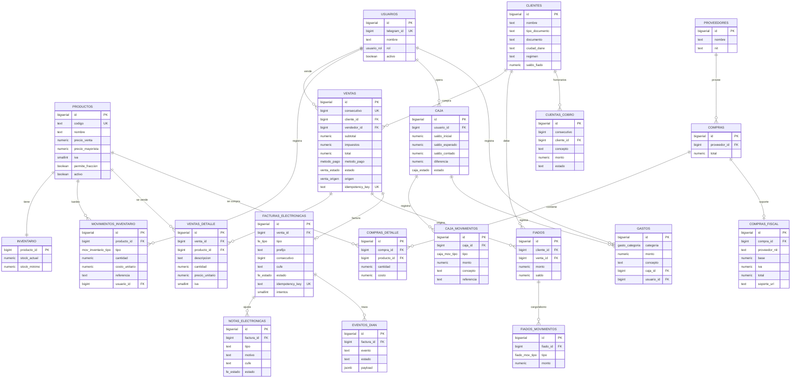
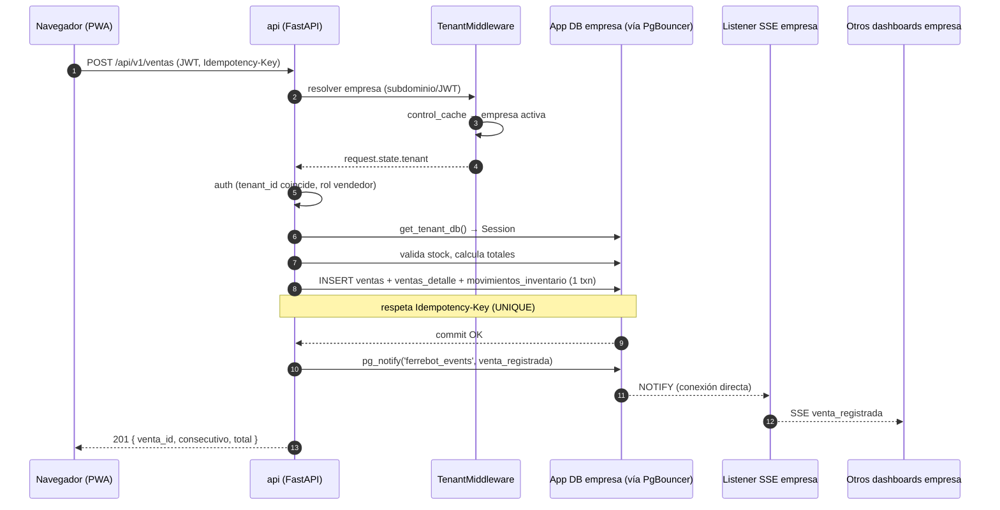
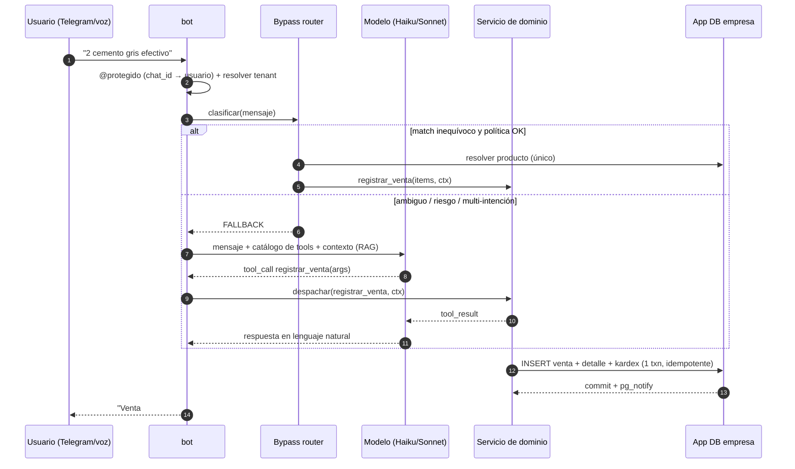
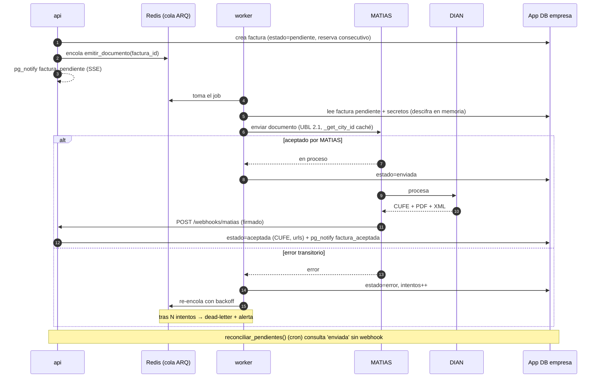
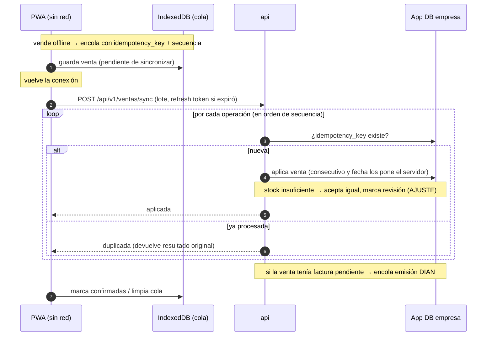
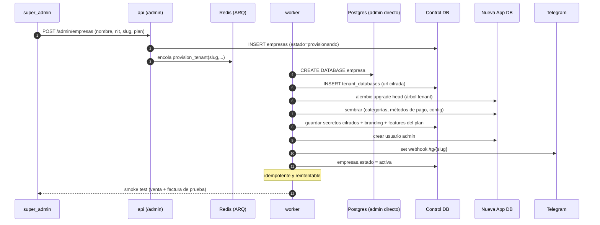

# Diagramas

> Vistas en Mermaid: arquitectura/topología, modelo entidad-relación (control DB y app DB) y secuencias de los flujos críticos. Fuentes: `architecture.md`, `tenancy.md`, `infra-railway.md`, `schema.md`, `facturacion-dian.md`, `offline-sync.md`, `ai-tools.md`.

---

## 1. Arquitectura general

---

## 2. Resolución de tenant (middleware)

---

## 3. ER — Control DB (plano de control)

---

## 4. ER — App DB por empresa (esquema de negocio)

> Sin columna `empresa_id`: la base ES la frontera del tenant.

---

## 5. Secuencia — Venta desde el dashboard (con SSE)

---

## 6. Secuencia — Mensaje al bot (bypass vs function calling)

---

## 7. Secuencia — Emisión DIAN asíncrona

---

## 8. Secuencia — Sincronización offline

---

## 9. Secuencia — Aprovisionamiento de una empresa

