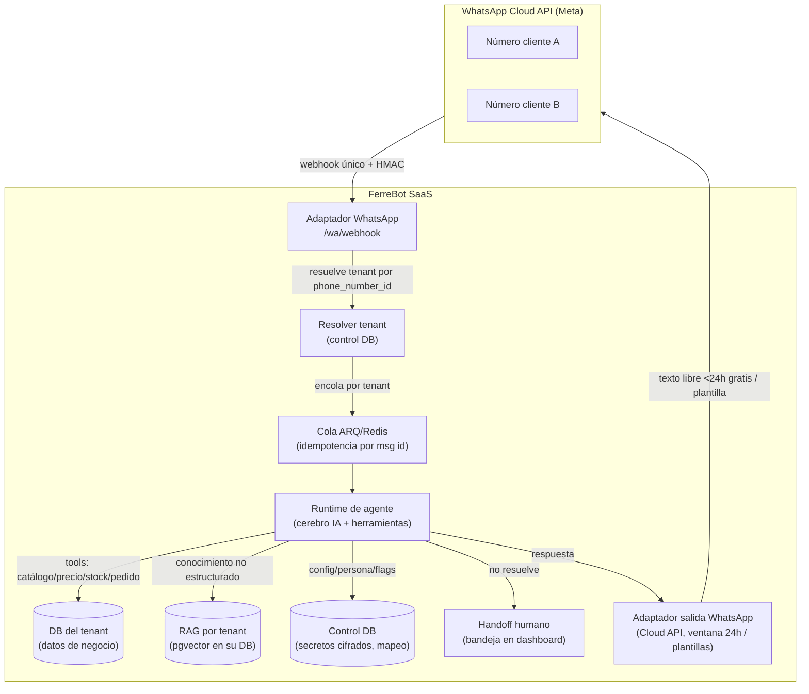

# Plataforma multi-tenant de agentes de WhatsApp — arquitectura propuesta

> Estrategia + arquitectura (7 jun 2026). Visión de Andrés: dejar lista una **infraestructura
> robusta y genérica** de agentes de atención al cliente en WhatsApp, de modo que dar de alta un
> cliente nuevo sea **"nutrir" el agente con su data (base de datos) y su lógica de negocio**, no
> reconstruir nada. Este doc reúne la investigación (Meta/WhatsApp 2025-26) y propone la arquitectura.
> **No es decisión cerrada:** la última sección lista las decisiones abiertas a discutir.

---

## Idea en una frase

Un **runtime de agente genérico** (el cerebro IA + herramientas) conectado a WhatsApp por un
**adaptador de canal**, donde cada empresa aporta solo **(a) sus datos** (ya viven en su base
por-tenant) y **(b) su configuración/lógica** (flags, persona, herramientas habilitadas, conocimiento).
La infraestructura no cambia entre clientes; solo se "nutre".

---

## Lo que YA tenemos a favor (no partimos de cero)

| Activo existente | Por qué importa para esto |
|---|---|
| **Bot en arquitectura hexagonal** (`apps/bot`: `ports.py`, `wiring.py`, `repos.py`, `redis_stores.py`) | El canal está **desacoplado** del cerebro. Telegram es un adaptador; **WhatsApp es otro adaptador**, no una reescritura. |
| **DB por tenant + control DB** | Es el aislamiento más fuerte (patrón "silo"). El conocimiento del agente por empresa cae natural en su propia base → **evita la fuga multi-tenant de vectores** (OWASP LLM08:2025). |
| **Agente Claude con function-calling + bypass** | El "cerebro" y las herramientas (consultar producto, precio, stock) ya existen y son reutilizables. |
| **Abstracción de proveedor LLM** (`docs/ai-provider-abstraction.md`) | Cambiar/escalar el modelo (Haiku worker / Sonnet orquestador) ya está resuelto. |
| **Feature flags + provisioning + RBAC + worker ARQ/Redis** | La maquinaria SaaS (alta, capacidades por empresa, jobs async) ya está. |

**Conclusión:** el trabajo nuevo es **el canal WhatsApp + el onboarding Meta + la capa de
conocimiento/handoff**, montado sobre cimientos que ya existen.

---

## Investigación clave (WhatsApp Business Platform, 2025-26)

### A. Cómo conecta un SaaS los WhatsApp de muchos clientes: **Tech Provider + Embedded Signup**
Meta tiene tres figuras:

- **Tech Provider** — desarrollas sobre la **Cloud API**, integras directo con Meta. Onboarding de
  clientes por **Embedded Signup** (flujo co-branded dentro de nuestro panel). El **cliente pone su
  propio medio de pago y Meta le factura los mensajes**; nosotros cobramos nuestra cuota SaaS. **No
  requiere línea de crédito.** Límite: hasta **200 clientes nuevos por semana** por "partner solution".
- **Solution Partner (antes BSP)** — tiene línea de crédito con Meta, **factura los mensajes al cliente
  con markup** (5-20%). Quita fricción al cliente (no mete su tarjeta) pero te vuelve intermediario de cobro.
- **Tech Partner** — Tech Provider "ascendido" (pasa revisión de Meta Business Partner), da acceso a perks.

**Lectura para nosotros:** el modelo **Tech Provider** encaja con un SaaS pequeño en Cartagena
(sin obligación de línea de crédito; Meta cobra los mensajes al comercio, nosotros la suscripción).
Atajo posible al inicio: **apoyarse en un BSP/Tech Provider existente** (Twilio, 360dialog, Gupshup,
Infobip) para saltarnos la verificación de Meta y salir más rápido. ← decisión abierta #1.

### B. Ruteo de webhooks (un solo endpoint para todos los tenants)
Capas de Meta: **Meta App** (config del webhook) → **WABA** (contenedor de números) → **número**.
- Un **único webhook** recibe todo. Para recibir de cada cliente: suscribir nuestra app a su WABA
  (`POST /{WABA_ID}/subscribed_apps`). *(Gotcha clásico "shadow delivery": si falta esa suscripción,
  los mensajes se pierden en silencio.)*
- Cada payload trae `metadata.phone_number_id` → con eso **resolvemos el tenant** (mapa en control DB).
- Verificación: token de verificación + **firma HMAC `X-Hub-Signature-256`** en cada POST.

### C. Pricing (cambió jul-2025) — favorece justo la atención al cliente
- Modelo **por mensaje** (no por conversación). **Responder dentro de la ventana de servicio de 24h
  (mensajes de servicio / texto libre) es GRATIS.** Solo se cobran **plantillas** iniciadas por el
  negocio (marketing siempre; utility fuera de ventana). → Un **agente reactivo de atención cuesta
  casi nada**; el costo aparece solo si mandamos campañas/notificaciones proactivas.
- El comercio paga esos mensajes a Meta directo (modelo Tech Provider).

### D. Regla de Meta (ene-2026)
Prohibidos los **chatbots de IA de propósito general** en la API. **Permitidos** los especializados
en un caso de negocio (atención, ventas, pedidos, soporte). El nuestro es especializado → cumple.

### E. Coexistence
El comercio puede seguir usando su **app de WhatsApp Business normal** en el mismo número **a la vez**
que la API (modo Coexistence). Clave para no "quitarles" su WhatsApp al conectarlos.

---

## Arquitectura propuesta

### Componentes nuevos

1. **Adaptador de entrada WhatsApp** (`apps/bot/canales/whatsapp/` o `apps/api`):
   webhook único, verificación HMAC, parseo, dedup por `message.id` (Meta reintenta), resolución de
   tenant por `phone_number_id`, responde **200 rápido** y encola el trabajo.

2. **Resolución de tenant + secretos**: tabla en control DB `wa_numeros (phone_number_id, waba_id,
   tenant_id, token_cifrado, estado)`. Token de acceso por cliente **cifrado** (igual patrón que MATIAS,
   `SECRETS_MASTER_KEY`).

3. **Runtime de agente** (reusa el cerebro actual del bot): recibe `(tenant, mensaje, estado_conv)`,
   con contexto de empresa resuelto. Function-calling sobre **herramientas** habilitadas por flags.

4. **Capa de conocimiento ("nutrir")** — dos vías complementarias:
   - **Datos estructurados → herramientas** (recomendado para transaccional: catálogo, precio, stock,
     horarios, políticas). Más confiable que RAG; **ya las tenemos** en el bot.
   - **Datos no estructurados → RAG por tenant** (FAQs, manuales, políticas que sube el comerciante):
     **pgvector en la base del propio tenant** (aislamiento por construcción). Pipeline de ingesta:
     subir doc en dashboard → chunk + embed → guardar en su DB. Toda consulta lleva el tenant implícito
     (la conexión ya apunta a su base).

5. **Handoff humano**: cuando el agente no resuelve (o el cliente pide humano), marca la conversación
   para atención y notifica al comercio. MVP: notificación + responder desde una **bandeja en el
   dashboard**; v2: inbox multiagente.

   > **Implementado (backend, 7 jun 2026).** Capacidad **transversal** (no solo agenda): tabla
   > `conversaciones` por tenant (`cliente_telefono` único, `estado` `bot`|`humano`, `motivo`,
   > `creada_en`/`escalada_en`/`resuelta_en`) en `modules/conversaciones/` (migración tenant 0009).
   > Herramienta de núcleo del runtime `escalar_humano(motivo)` (`ai/handoff_tools.py`, `feature=None`
   > → siempre disponible a cualquier agente; el tenant+teléfono salen SIEMPRE del `Contexto`, nunca
   > del modelo) expuesta junto a las `agenda_tools` por `apps.wa.agent.exponer_runtime`. **Pausa del
   > agente:** `AgenteWa.atender` consulta `esta_en_humano` ANTES de correr el LLM; si está en `humano`
   > guarda el mensaje entrante (memoria) y **no responde** hasta que se resuelva. Router
   > `/api/v1/conversaciones` (gateado por el flag `canal_whatsapp`, RBAC staff): `GET /escaladas` y
   > `POST /{id}/resolver` (estado→`bot`, sella `resuelta_en`). Escalar y resolver emiten SSE
   > (`conversacion_escalada` / `conversacion_resuelta`, acotado al tenant). **Pendiente:** la bandeja
   > del dashboard (UI), los recordatorios y la notificación al asesor por número configurado.

6. **Adaptador de salida WhatsApp**: envío por Cloud API. Texto libre dentro de ventana 24h (gratis);
   plantillas aprobadas para fuera de ventana / proactivo. Reintentos + registro de estado de entrega.

7. **Onboarding (Embedded Signup)** en el panel super-admin: el comercio conecta su WABA/número; al
   completar → guardar WABA/número/token, **suscribir la app a su WABA**, registrar el mapeo. (Atajo:
   vía BSP si elegimos esa ruta — decisión #1.)

### Aislamiento y seguridad (no negociable)
- **DB por tenant** = silo. El RAG vive en la base del tenant → **imposible** cruzar conocimiento entre
  empresas. Mitiga OWASP **LLM08:2025** (fuga en vectores multi-tenant).
- Cada invocación del agente carga el **tenant resuelto**; ninguna herramienta puede tocar otra base.
- **Idempotencia** por `message.id`; **rate limit por tenant**; verificación HMAC del webhook.
- Defensa de **inyección de prompt** (el contenido del cliente final entra a la cadena de razonamiento
  y el agente actúa por herramientas → validar/limitar qué puede hacer una herramienta).
- Cumplimiento Habeas Data (Ley 1581) cuando haya empresas externas (ya anotado en `security.md`).

### Operación
- **Async** (worker ARQ/Redis ya existe) para ráfagas; el webhook nunca bloquea.
- **Estado de conversación** en Redis por tenant (patrón ya usado por el bot).
- **Observabilidad** con `tenant_id`/`request_id` (Sentry ya cableado).
- **Feature flag** nueva: `canal_whatsapp` (+ subflags: `wa_pedidos`, `wa_rag`, `wa_handoff`).

---

## Modelo de capacidades: runtime + packs + datos (refinado 7 jun 2026)

El bot actual de Telegram es un asistente **para el operador del negocio** (un vendedor registra ventas).
Los agentes de WhatsApp son **de cara al cliente final** (un paciente agenda una cita). Comparten
**infraestructura**, no **lógica de dominio**. Por eso no se "reusa el cerebro de ferretería" para una
odontología: se reusa el **runtime**, y la lógica de cada vertical entra como **pack enchufable**.

**Tres capas:**

1. **Runtime genérico (se reusa siempre):** adaptador de canal (WhatsApp/Kapso, Telegram), resolución de
   tenant por número, bucle del agente (mensaje → Claude con herramientas → respuesta), estado de
   conversación, guardarraíles, handoff a humano, abstracción de modelo IA. Inversión grande, una sola vez.
2. **Capability packs (modular, por tipo de uso):** conjuntos de herramientas + motor + esquema de reglas
   por dominio. Ej.: `agenda/citas`, `catalogo/pedidos`, `faq/conocimiento`, `captura_lead`,
   `escalar_humano`. La ferretería de Punto Rojo es **un pack más** (ventas); su bug vive ahí y no afecta
   a otros negocios. Cada pack se construye una vez y sirve a todos los negocios de ese tipo.
3. **Configuración + datos por tenant ("nutrir"):** el negocio aporta su data (servicios, horarios,
   catálogo), su persona/tono y qué packs tiene activos (feature flags). Cliente nuevo del mismo tipo =
   activar packs + cargar datos, sin programar.

**Guardarraíl de packs de cara al cliente:** sus herramientas deben ser seguras y limitadas — nunca
borrar data, ver datos de otros clientes ni operaciones destructivas; solo lo de su rol.

### Dónde vive la lógica de negocio

Principio (ya en `CLAUDE.md`): **reglas en datos/motor, nunca en el prompt; el agente nunca calcula.**

| Tipo de regla | Ejemplo | Dónde vive |
|---|---|---|
| Regla configurable (varía por ítem/negocio) | precios del thinner (5000/4000…), factor 100 de la lija, duración de cita, horario | **Datos** en la base del tenant |
| Cómo se computa la regla | fracción vs. escalonado vs. factor de unidad; disponibilidad de agenda | **Motor (código)** del capability pack |
| Orquestar / entender al cliente | "quiero 20 cm de lija" → llama al motor | **El agente** (nunca calcula) |

Caso testigo: el thinner (varios precios) **ya** es representable (escalonado/fracciones en datos). La
lija "por 100 cm" **no** — falta un atributo *factor de unidad*; el arreglo correcto es **dato + línea de
motor**, no prompt. Cada pack define el **esquema de reglas configurables** de su dominio; el tenant
rellena los valores; el motor del pack los aplica.

---

## Cómo encaja con el roadmap actual
- Es el bloque **"canal WhatsApp"** que el handoff anterior listaba como mayor cierre de brecha
  producto-mercado (87% de mipymes venden por WhatsApp).
- Reutiliza Fases 9 (flags), 11 (dashboard, para bandeja/ingesta), 13 (provisioning/onboarding).
- **Dependencia de calidad:** conviene cerrar antes el **bug del motor de precios** y el slot-filling
  del bot (handoff: lija por cm cobró $400.000), porque el mismo cerebro alimentará WhatsApp. Vender un
  agente a medias quema reputación. ← decisión #5.

---

## Decisiones abiertas (esto es lo que toca discutir antes de codear)

1. ~~**Tech Provider directo vs. apoyarnos en un BSP**~~ → **DECIDIDO (7 jun 2026): Kapso (BSP) como
   transporte para el MVP, un solo número** (plan free para desarrollo). Kapso pasa la facturación de
   Meta directo a la WABA (sin markup por mensaje, economía tipo Tech Provider) y trae onboarding
   multi-tenant ("Platform"), SDK/CLI/MCP. **El cerebro, la lógica y la data siguen siendo nuestros**
   (Kapso solo mueve mensajes; no usamos su motor de IA). Reevaluar **Twilio o Tech Provider directo**
   cuando el volumen/los números justifiquen salir del costo por número del BSP.
2. **Conocimiento: ¿tools-only al principio, o tools + RAG desde ya?** Mi instinto: arrancar
   **tools-only** (datos estructurados, ya los tenemos) y añadir RAG cuando un cliente traiga docs.
3. **Handoff humano: ¿MVP con notificación + responder en dashboard, o inbox multiagente completo?**
4. **Lógica de negocio del agente: ¿config/flags (un agente genérico configurable) o código por
   vertical?** La visión "solo nutrir" empuja a **genérico configurable**; los verticales serían
   paquetes de herramientas + persona.
5. **¿Reusar el cerebro del bot actual (Telegram) o runtime nuevo?** Recomiendo **reusar** (hexagonal ya
   lo permite), pero implica **terminar el motor de precios/slot-filling** primero.
6. **Número del cliente: ¿Coexistence (mantiene su WhatsApp Business app) o número dedicado?**
   Coexistence reduce fricción de venta pero añade casos borde.
7. **¿Quién es el primer agente real?** ¿Punto Rojo como piloto interno del canal WhatsApp, o un comercio
   amigo? Eso define si el onboarding puede ser manual al inicio.

---

## Fuentes
- Tech Provider / Embedded Signup (Meta): https://developers.facebook.com/documentation/business-messaging/whatsapp/embedded-signup/onboarding-customers-as-a-tech-provider/ · https://developers.facebook.com/documentation/business-messaging/whatsapp/embedded-signup/overview/
- Tech Provider vs BSP (Solution Partner): https://whautomate.com/whatsapp-tech-provider-vs-bsp · https://developers.facebook.com/documentation/business-messaging/whatsapp/solution-providers/overview
- Webhooks / ruteo por phone_number_id + suscripción de WABA: https://developers.facebook.com/docs/whatsapp/cloud-api/guides/set-up-webhooks/ · https://medium.com/@siri.prasad/the-shadow-delivery-mystery-why-your-whatsapp-cloud-api-webhooks-silently-fail-and-how-to-fix-2c7383fec59f
- Pricing por mensaje jul-2025 (servicio gratis en ventana 24h): https://developers.facebook.com/docs/whatsapp/pricing/updates-to-pricing/ · https://clevertap.com/blog/whatsapp-business-pricing-changes-in-july-2025/
- Regla Meta IA 2026 (bots especializados): https://chatsell.net/whatsapp-business-ecommerce-colombia-automatizar-ventas-2026/
- Arquitectura de agentes multi-tenant + aislamiento (OWASP LLM08:2025, RAG por tenant): https://blaxel.ai/blog/multi-tenant-isolation-ai-agents · https://aws.amazon.com/blogs/machine-learning/multi-tenant-rag-with-amazon-bedrock-knowledge-bases/
